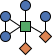

<p align="center">
  
</p>

# HINGE — Heterogeneous Information Network for Generalized Extraction 

`hinge` ingests GitHub activity datasets (JSONL today; CSV/Parquet planned), persists
them as a typed multi-relational graph in DuckDB, and exposes **projections** —
dbt SQL models that derive task-specific sub-graphs and export them to formats
consumed by Gephi, NetworkX, igraph, etc.

This is a research artefact accompanying an ICSME 2026 Tools and Data Showcase submission.

## Installation

`hinge` is available on PyPI:

```bash
pip install hinge
```

This installs the `hinge` CLI and exposes the package as a Python library:

```python
import hinge

hinge.ingest(...)
hinge.project(...)
hinge.export(...)
```

---

## Quick start

```bash
# 1. Install (uv is the only supported package manager)
uv sync --all-extras

# 2. Ingest a dataset
uv run hinge ingest path/to/events.jsonl --reader numfocus
# → ingested 48 elements → 29 nodes, 19 edges (0 violations)
# → Dataset ID: 78fc87c370944dc2b4a4e2d4bdd97ce1

# 3. Use the printed Dataset ID to run a projection and export
uv run hinge export \
  --dataset 78fc87c370944dc2b4a4e2d4bdd97ce1 \
  --projection user-user-repo-collaboration \
  --format gml \
  -o out/graph.gml

# 4. Inspect all ingested datasets
uv run hinge list datasets
```

Or via Docker:

```bash
docker compose build
cp path/to/events.jsonl ./data/
docker compose run --rm hinge hinge ingest /data/events.jsonl --reader numfocus
docker compose run --rm hinge hinge export \
  --dataset <id> --projection user-user-repo-collaboration --format gml -o /output/graph.gml
```

The DuckDB store lives at `$HINGE_STORE_PATH` (default `./network.duckdb`
locally, `/store/network.duckdb` inside the container). Multiple datasets
can coexist in the same file — each ingest run gets a unique Dataset ID.

---

## HIN contract + adapters

The source-agnostic core starts at the adapter contract tables:

```text
source-specific adapter
  -> contract_accounts / contract_repositories / contract_artifacts / contract_relations
  -> hin_nodes / hin_edges
  -> dbt projections
  -> exporters
```

The `numfocus` reader uses a DuckDB adapter for this repo's NumFocus Actions
JSONL scrape. It is intentionally source-specific: it knows paths like
`$.actor.login` and `$.details.pull_request.id`. Other data sources should
implement their own adapter that writes the same `contract_*` tables; then the
HIN views and dbt recipes can run unchanged.

The generic Python `ReaderStage` path is still available for simple custom
readers, but large JSONL ingests should use a DuckDB/SQL contract adapter where
possible.

---

## Adding a new projection

A projection is a dbt SQL model that derives a task-specific sub-graph from
the typed HIN stored in DuckDB. Adding one requires exactly four files/edits
and no changes to the kernel.

### Step 1 — Write the SQL model

Create `hinge/dbt/models/networks/<name>.sql`. The model should read from
the canonical HIN dbt models and produce a fixed set of columns:

```sql
-- Inputs (prefer these canonical HIN models, never the raw tables)
{{ ref('hin_nodes') }}
{{ ref('hin_edges') }}

-- Output (prefer the network_edges macro; it emits this standard schema)
network_edges(
    recipe_name, recipe_version,
    source_node_id, source_node_type,
    target_node_id, target_node_type,
    directed, edge_type,
    weight, weight_kind,
    n_contexts, n_events,
    first_seen_at, last_seen_at,
    time_bin, bot_policy,
    properties
)
```

`DbtProjection` converts this richer schema into `TypedEdge` objects for existing
exporters, merging standard fields and `properties` into edge attrs.

The upstream HIN models are built from `active_*` views created by the store
immediately before dbt runs — they are already filtered to the requested
`dataset_id`, so network SQL never needs to reference `dataset_id` at all.

**Nodes-only projections:** the pipeline derives output nodes from the union
of `source_node_id` and `target_node_id` in the result table. A projection that
emits no edges will therefore produce no nodes either. The workaround is to use
**self-loop edges** (`source_node_id = target_node_id`): they make the nodes
visible to the exporter, carry metadata in `properties`, and can be filtered out
in downstream tools with `G.remove_edges_from(nx.selfloop_edges(G))`.

See [dev_interaction.sql](hinge/dbt/models/networks/dev_interaction.sql)
for a full working example with a documented input/output contract.

### Step 2 — Create the spec module

Create `hinge/stages/projection/specs/<name>.py` and expose a `SPEC` constant:

```python
from hinge.kernel.projection.projection_spec import ProjectionSpec

SPEC = ProjectionSpec(
    name="my-projection",          # CLI key: --projection my-projection
    description="...",
    model_name="my_projection",    # must match the .sql file stem
    output_node_types=["user"],
    output_edge_types=["my_edge_label"],
)
```

This is a plain value object — no class, no inheritance. The registry loads
the module and returns the `SPEC` attribute directly.

### Step 3 — Register the entry-point

Add one line to `pyproject.toml`:

```toml
[project.entry-points."hinge.projection_specs"]
my-projection = "hinge.stages.projection.specs.my_projection:SPEC"
```

Third-party packages can register projections the same way — no fork required.

### Step 4 — Re-install so the entry-point is picked up

```bash
uv sync --all-extras
uv run hinge list projections    # → my-projection should appear
```

Entry-points are baked into `.dist-info/entry_points.txt` at install time.
Without this step the registry will not find the new spec.

### Run it

```bash
uv run hinge export \
  --dataset <id> \
  --projection my-projection \
  --format gml \
  -o output/result.gml
```

### Local SQL custom projection

For research-specific variants, write a local dbt model and run it without
packaging or entry-points:

```bash
uv run hinge export-sql custom_star_user_repo.sql \
  --dataset <id> \
  --format gml \
  -o output/custom.gml
```

The SQL file is temporarily added to the built-in dbt project, so it can use
`ref('hin_edges')`, `ref('int_user_artifact_incidence')`, and all macros under
`hinge/dbt/macros/`. It must still emit the standard `network_edges` schema.
Use `--name valid_model_name` if the filename is not a valid dbt identifier.

See [docs/custom-projections.md](docs/custom-projections.md).

### Third-party plugins

Readers, exporters, projection specs, stores, and projection engines can be
shipped as separate PyPI packages — `hinge` discovers them through standard
Python entry-points, with no plugin API to learn beyond the kernel protocols.
See [docs/plugins.md](docs/plugins.md) for the contract and a worked example.

---

## Logging

Logs go to **stderr** by default. Use env vars to control verbosity and persistence:

| Variable | Purpose | Default |
|---|---|---|
| `HINGE_LOG_LEVEL` | `DEBUG` / `INFO` / `WARNING` / `ERROR` | `INFO` |
| `HINGE_LOG_FILE` | Also write logs to this file at full `DEBUG` detail | _(none)_ |

```bash
# See all pipeline milestones (default)
uv run hinge ingest events.jsonl --reader numfocus

# See every batch, dbt SQL, store open/close
HINGE_LOG_LEVEL=DEBUG uv run hinge ingest events.jsonl --reader numfocus

# Persist a full debug log to disk (useful for long ingest runs)
HINGE_LOG_FILE=hinge.log uv run hinge ingest events.jsonl --reader numfocus
tail -f hinge.log
```

---

## Common commands

```bash
# Ingest NumFocus Actions JSONL via the DuckDB -> HIN contract adapter
uv run hinge ingest events.jsonl --reader numfocus

# Inspect stored datasets
uv run hinge list datasets
uv run hinge list projections
uv run hinge list readers
uv run hinge list exporters

# Export
uv run hinge export --dataset <id> --projection user-user-repo-collaboration --format gml -o out.gml

# Dev / CI
uv run pytest                                # tests
uv run ruff check .                          # lint
uv run ruff format .                         # format
uv run mypy hinge/kernel hinge/frontends     # strict type-check
uv run lint-imports                          # enforce kernel/stages/frontends boundary
```

---

## Makefile (development)

A `Makefile` is provided for quick local iteration. It uses hardcoded defaults
(fixture file, `numfocus` reader, `user-user-repo-collaboration` projection, GML format) so
you don't have to remember arguments during development — **not intended for
production use**.

```bash
make install     # uv sync --all-extras
make run         # ingest fixture + export graph in one shot
make ingest      # ingest tests/fixtures/events_10.jsonl --reader numfocus
make export      # export the latest dataset (auto-detects ID from the store)
make test        # pytest
make lint        # ruff check
make fmt         # ruff format
make typecheck   # mypy on kernel + frontends
make clean       # delete output/, dbt artefacts, caches
make reset       # clean + delete network.duckdb (full fresh start)
```

Any default can be overridden on the command line:

```bash
make run   READER=numfocus LOG_LEVEL=DEBUG
make export FORMAT=graphml OUTPUT=output/graph.graphml
```
